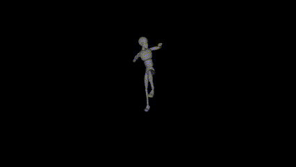

# OpenGL & C++ Animation Demo

Using assimp, nlohmann, glfw, glew lib.

## Sample animation

## Build

visual studio and msvc x86 compiler. CMake. You can replace x86 lib with x64 lib in this project to build for x64 platform.

Recommand to build with vscode and cmake ext.

## How to use

Change `asset/config.json` with your model path & animation play options.